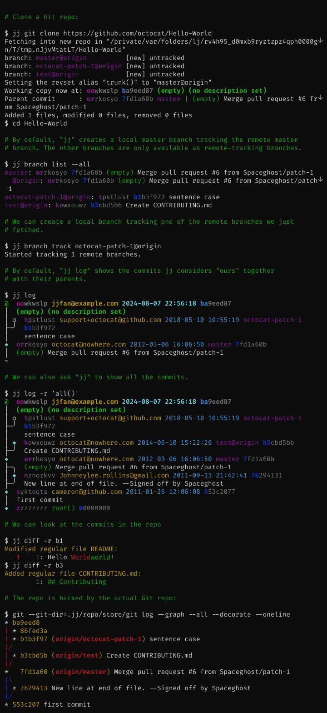
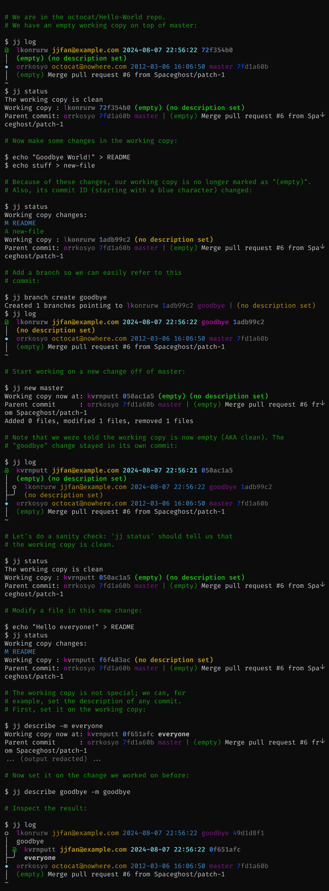
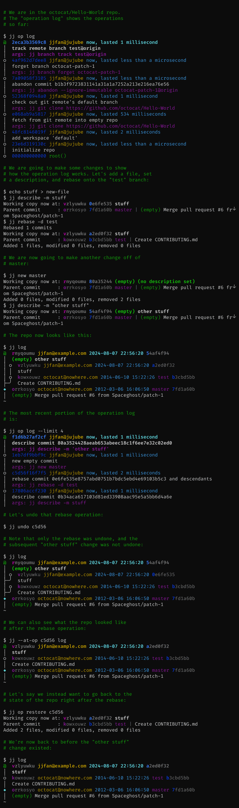
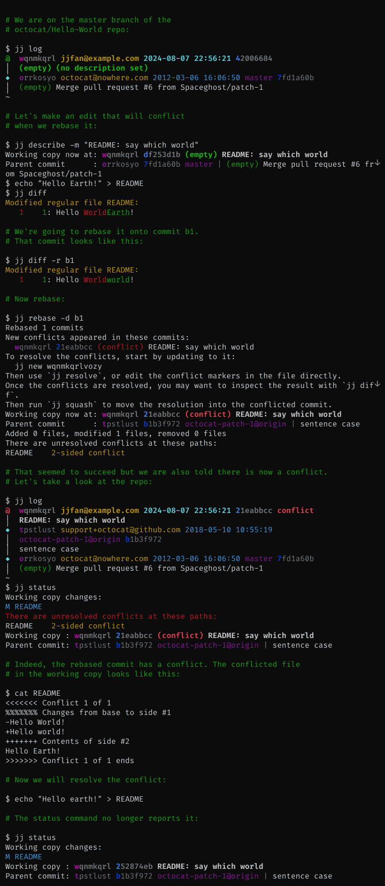
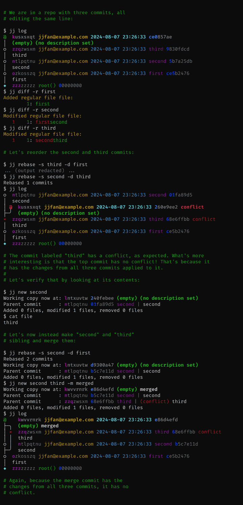

# Jujutsu—a version control system

 

**[Homepage] &nbsp;&nbsp;&bull;&nbsp;&nbsp;**
**[Installation] &nbsp;&nbsp;&bull;&nbsp;&nbsp;**
**[Getting Started]**

[Homepage]: https://martinvonz.github.io/jj
[Installation]: https://martinvonz.github.io/jj/latest/install-and-setup
[Getting Started]: https://martinvonz.github.io/jj/latest/tutorial

## Introduction

Jujutsu is a powerful [version control system](https://en.wikipedia.org/wiki/Version_control)
for software projects. You use it to get a copy of your code, track changes
to the code, and finally publish those changes for others to see and use.
It is designed from the ground up to be easy to use—whether you're new or
experienced, working on brand new projects alone, or large scale software
projects with large histories and teams.

Jujutsu is unlike most other systems, because internally it abstracts the user
interface and version control algorithms from the *storage systems* used to
serve your content. This allows it to serve as a VCS with many possible physical
backends, that may have their own data or networking models—like [Mercurial] or
[Breezy], or hybrid systems like Google's cloud-based design, [Piper/CitC].

[Mercurial]: https://www.mercurial-scm.org/
[Breezy]: https://www.breezy-vcs.org/
[Piper/CitC]: https://youtu.be/W71BTkUbdqE?t=645

Today, we use Git repositories as a storage layer to serve and track content,
making it **compatible with many of your favorite Git-based tools, right now!**
All core developers use Jujutsu to develop Jujutsu, right here on GitHub. But it
should hopefully work with your favorite Git forges, too.

We combine many distinct design choices and concepts from other version control
systems into a single tool. Some of those sources of inspiration include:

- **Git**: We make an effort to [be fast][perf]—with a snappy UX, efficient
  algorithms, correct data structures, and good-old-fashioned attention to
  detail. The default storage backend uses Git repositories for "physical
  storage", for wide interoperability and ease of onboarding.

- **Mercurial & Sapling**: There are many Mercurial-inspired features, such as
  the [revset] language to select commits. There is [no explicit index][no-index]
  or staging area. Branches are "anonymous" like Mercurial, so you don't need
  to make up a name for each small change. Primitives for rewriting history are
  powerful and simple. Formatting output is done with a robust template language
  that can be configured by the user.

- **Pijul & Darcs**: Jujutsu keeps track of conflicts as [first-class
  objects][conflicts] in its model; they are first-class in the same way commits
  are, while alternatives like Git simply think of conflicts as textual diffs.
  While not as rigorous as systems like Darcs and Pijul (which are based on a
  formalized theory of patches, as opposed to snapshots), the effect is that
  many forms of conflict resolution can be performed and propagated
  automatically.

[perf]: https://github.com/martinvonz/jj/discussions/49
[revset]: https://martinvonz.github.io/jj/latest/revsets/
[no-index]: https://martinvonz.github.io/jj/latest/git-comparison/#the-index
[conflicts]: https://martinvonz.github.io/jj/latest/conflicts/

And it adds several innovative, useful features of its own:

- **Working-copy-as-a-commit**: Changes to files are [recorded automatically][wcc]
  as normal commits, and amended on every subsequent change. This "snapshot"
  design simplifies the user-facing data model (commits are the only visible
  object), simplifies internal algorithms, and completely subsumes features like
  Git's stashes or the index/staging-area.

- **Operation log & undo**: Jujutsu records every operation that is performed on the
  repository, from commits, to pulls, to pushes. This makes debugging problems like
  "what just happened?" or "how did I end up here?" easier, *especially* when
  you're helping your coworker answer those questions about their repository!
  And because everything is recorded, you can undo that mistake you just made
  with ease. Version control has finally entered [the 1960s][undo-history]!

- **Automatic rebase and conflict resolution**: When you modify a commit, every
  descendent is automatically rebased on top of the freshly-modified one. This
  makes "patch-based" workflows a breeze. If you resolve a conflict in a commit,
  the _resolution_ of that conflict is also propagated through descendants as
  well. In effect, this is a completely transparent version of `git rebase
  --update-refs` combined with `git rerere`, supported by design.

> [!WARNING]
> The following features are available for use, but experimental; they may have
> bugs, backwards incompatible storage changes, and user-interface changes!

- **Safe, concurrent replication**: Have you ever wanted to store your version
  controlled repositories inside a Dropbox folder? Or continuously backup
  repositories to S3? No? Well, now you can!

  The fundamental problem with using filesystems like Dropbox and backup tools
  like `rsync` on your typical Git/Mercurial repositories is that they rely
  on *local filesystem operations* being atomic, serialized, and non-concurrent
  with respect to other reads and writes—which is _not_ true when operating on
  distributed file systems, or when operations like concurrent file copies (for
  backup) happen while lock files are being held.

  Jujutsu is instead designed to be [safe under concurrent scenarios][conc-safety];
  simply using rsync or Dropbox and then using that resulting repository
  should never result in a repository in a *corrupt state*. The worst that
  _should_ happen is that it will expose conflicts between the local and remote
  state, leaving you to resolve them.

[wcc]: https://martinvonz.github.io/jj/latest/working-copy/
[undo-history]: https://en.wikipedia.org/wiki/Undo#History
[conc-safety]: https://martinvonz.github.io/jj/latest/technical/concurrency/

The command-line tool is called `jj` for now because it's easy to type and easy
to replace (rare in English). The project is called "Jujutsu" because it matches
"jj".

Jujutsu is relatively young, with lots of work to still be done. If you have any
questions, or want to talk about future plans, please join us on Discord

or start a [GitHub Discussion](https://github.com/martinvonz/jj/discussions); the
developers monitor both channels.

### News and Updates 📣

- **Feb 2024**: Version 0.14 is released, which deprecates ["jj checkout" and "jj merge"](CHANGELOG.md#deprecations-1),
  as well as `jj init --git`, which is now just called `jj git init`. 
- **Oct 2023**: Version 0.10.0 is released! Now includes a bundled merge and
  diff editor for all platforms, "immutable revsets" to avoid accidentally
  `edit`-ing the wrong revisions, and lots of polish.
- **Jan 2023**: Martin gave a presentation about Google's plans for Jujutsu at
  Git Merge 2022! 
  See the [slides][merge-slides] or the [recording][merge-talk].

### Related Media

- **Mar 2024**: Chris Krycho started [a YouTube series about Jujutsu][krycho-yt].
- **Feb 2024**: Chris Krycho published an article about Jujutsu called [jj init][krycho]
  and Steve Klabnik followed up with the [Jujutsu Tutorial][klabnik]. 
- **Jan 2024**: Jujutsu was featured in an LWN.net article called 
  [Jujutsu: a new, Git-compatible version control system][lwn].
- **Jan 2023**: Martin's Talk about Jujutsu at Git Merge 2022, [video][merge-talk] 
  and the associated [slides][merge-slides].

[krycho-yt]: https://www.youtube.com/playlist?list=PLelyiwKWHHAq01Pvmpf6x7J0y-yQpmtxp
[krycho]: https://v5.chriskrycho.com/essays/jj-init/
[klabnik]: https://steveklabnik.github.io/jujutsu-tutorial/
[lwn]: https://lwn.net/Articles/958468/ 
[merge-talk]: https://www.youtube.com/watch?v=bx_LGilOuE4
[merge-slides]: https://docs.google.com/presentation/d/1F8j9_UOOSGUN9MvHxPZX_L4bQ9NMcYOp1isn17kTC_M/view 

## Getting started

> [!IMPORTANT]
> Jujutsu is an **experimental version control system**. While Git compatibility
> is stable, and most developers use it daily for all their needs, there may
> still be work-in-progress features, suboptimal UX, and workflow gaps that make
> it unusable for your particular use.

Follow the [installation
instructions](https://martinvonz.github.io/jj/latest/install-and-setup) to
obtain and configure `jj`.

The best way to get started is probably to go through [the
tutorial](https://martinvonz.github.io/jj/latest/tutorial). Also see the [Git
comparison](https://martinvonz.github.io/jj/latest/git-comparison), which
includes a table of `jj` vs. `git` commands.

As you become more familiar with Jujutsu, the following resources may be helpful:

- The [FAQ](https://martinvonz.github.io/jj/latest/FAQ).
- The [Glossary](https://martinvonz.github.io/jj/latest/glossary).
- The `jj help` command (e.g. `jj help rebase`).

If you are using a **prerelease** version of `jj`, you would want to consult
[the docs for the prerelease (main branch)
version](https://martinvonz.github.io/jj/prerelease/). You can also get there
from the docs for the latest release by using the website's version switcher. The version switcher is visible in
the header of the website when you scroll to the top of any page.

## Features

### Compatible with Git

Jujutsu is designed so that the underlying data and storage model is abstract.
Today, it features two [backends]—one of them uses a Git repository for storage,
while the other is a native storage backend[^native-backend].

[backends]: https://martinvonz.github.io/jj/latest/glossary#backend

[^native-backend]: At this time, there's practically no reason to use the native
backend. The backend exists mainly to make sure that it's possible to eventually
add functionality that cannot easily be added to the Git backend.

The Git backend is fully featured and maintained, and allows you to use Jujutsu
as an alternative interface to Git. The commits you create will look like
regular Git commits. You can always switch back to Git. The Git support uses the
[libgit2](https://libgit2.org/) C library.

You can even have a ["co-located" local
repository](https://martinvonz.github.io/jj/latest/git-compatibility#co-located-jujutsugit-repos)
where you can use both `jj` and `git` commands interchangeably.

### The working copy is automatically committed

Jujutsu uses a real commit to represent the working copy. Checking out a commit
results a new working-copy commit on top of the target commit. Almost all
commands automatically amend the working-copy commit.

The working-copy being a commit means that commands never fail because the
working copy is dirty (no "error: Your local changes to the following
files..."), and there is no need for `git stash`. Also, because the working copy
is a commit, commands work the same way on the working-copy commit as on any
other commit, so you can set the commit message before you're done with the
changes.

### The repo is the source of truth

With Jujutsu, the working copy plays a smaller role than with Git. Commands
snapshot the working copy before they start, then they update the repo, and then
the working copy is updated (if the working-copy commit was modified). Almost
all commands (even checkout!) operate on the commits in the repo, leaving the
common functionality of snapshotting and updating of the working copy to
centralized code. For example, `jj restore` (similar to `git restore`) can
restore from any commit and into any commit, and `jj describe` can set the
commit message of any commit (defaults to the working-copy commit).

### Entire repo is under version control

All operations you perform in the repo are recorded, along with a snapshot of
the repo state after the operation. This means that you can easily revert to an
earlier repo state, or to simply undo a particular operation (which does not
necessarily have to be the most recent operation).

### Conflicts can be recorded in commits

If an operation results in
[conflicts](https://martinvonz.github.io/jj/latest/glossary#conflict),
information about those conflicts will be recorded in the commit(s). The
operation will succeed. You can then resolve the conflicts later. One
consequence of this design is that there's no need to continue interrupted
operations. Instead, you get a single workflow for resolving conflicts,
regardless of which command caused them. This design also lets Jujutsu rebase
merge commits correctly (unlike both Git and Mercurial).

Basic conflict resolution:

Juggling conflicts:

### Automatic rebase

Whenever you modify a commit, any descendants of the old commit will be rebased
onto the new commit. Thanks to the conflict design described above, that can be
done even if there are conflicts. Branches pointing to rebased commits will be
updated. So will the working copy if it points to a rebased commit.

### Comprehensive support for rewriting history

Besides the usual rebase command, there's `jj describe` for editing the
description (commit message) of an arbitrary commit. There's also `jj diffedit`,
which lets you edit the changes in a commit without checking it out. To split
a commit into two, use `jj split`. You can even move part of the changes in a
commit to any other commit using `jj squash -i --from X --into Y`.

## Status

The tool is fairly feature-complete, but some important features like (the
equivalent of) `git blame` are not yet supported. There
are also several performance bugs. It's likely that workflows and setups
different from what the core developers use are not well supported, e.g. there
is no native support for email-based workflows.

Today, all core developers use `jj` to work on `jj`. I (Martin von Zweigbergk)
have almost exclusively used `jj` to develop the project itself since early
January 2021. I haven't had to re-clone from source (I don't think I've even had
to restore from backup).

There *will* be changes to workflows and backward-incompatible changes to the
on-disk formats before version 1.0.0. Even the binary's name may change (i.e.
away from `jj`). For any format changes, we'll try to implement transparent
upgrades (as we've done with recent changes), or provide upgrade commands or
scripts if requested.

## Related work

There are several tools trying to solve similar problems as Jujutsu. See
[related work](https://martinvonz.github.io/jj/latest/related-work) for details.

## Contributing

We welcome outside contributions, and there's plenty of things to do, so
don't be shy. Please ask if you want a pointer on something you can help with,
and hopefully we can all figure something out.

We do have [a few policies and
suggestions](https://martinvonz.github.io/jj/prerelease/contributing/)
for contributors. The broad TL;DR:

- Bug reports are very welcome!
- Every commit that lands in the `main` branch is code reviewed.
- Please behave yourself, and obey the Community Guidelines.
- There **is** a mandatory CLA you must agree to. Importantly, it **does not**
  transfer copyright ownership to Google or anyone else; it simply gives us the
  right to safely redistribute and use your changes.

### Mandatory Google Disclaimer

I (Martin von Zweigbergk, <martinvonz@google.com>) started Jujutsu as a hobby
project in late 2019, and it has evolved into my full-time project at Google,
with several other Googlers (now) assisting development in various capacities.
That said, **this is not a Google product**.

## License

Jujutsu is available as Open Source Software, under the Apache 2.0 license. See
[LICENSE](./LICENSE) for details about copyright and redistribution.
