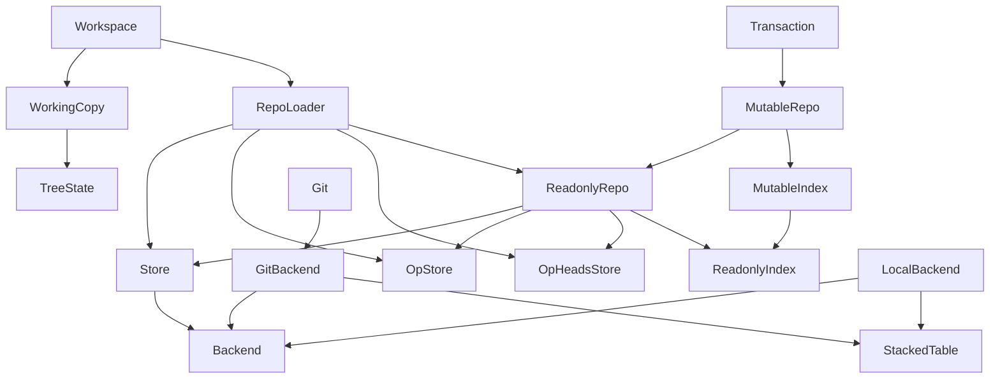

# Architecture

## Data model

The commit data model is similar
to [Git's object model](https://git-scm.com/book/en/v2/Git-Internals-Git-Objects)
, but with some differences.

## Separation of library from UI

The `jj` binary consists of two Rust crates: the library crate (`jj-lib`) and
the CLI crate (`jj-cli`). The library crate is currently only used by the CLI
crate, but it is meant to also be usable from a GUI or TUI, or in a server
serving requests from multiple users. As a result, the library should avoid
interacting directly with the user via the terminal or by other means; all
input/output is handled by the CLI crate [^1]. Since the library crate is meant
to usable in a server, it also cannot read configuration from the user's home
directory, or from user-specific environment variables.

[^1]: There are a few exceptions, such as for messages printed during automatic
upgrades of the repo format

A lot of thought has gone into making the library crate's API easy to use, but
not much has gone into "details" such as which collection types are used, or
which symbols are exposed in the API.

## Storage-independent APIs

One overarching principle in the design is that it should be easy to change
where data is stored. The goal was to be able to put storage on local-disk by
default but also be able to move storage to the cloud at Google
(and for anyone). To that end, commits (and trees, files, etc.) are stored by
the commit backend, operations (and views) are stored by the operation backend,
the heads of the operation log are stored by the "op heads" backend, the commit
index is stored by the index backend, and the working copy is stored by the
working copy backend. The interfaces are defined in terms of plain Rust data
types, not tied to a specific format. The working copy doesn't have its own
trait defined yet, but its interface is small and easy to create traits for when
needed.

The commit backend to use when loading a repo is specified in
the `.jj/repo/store/type` file. There are similar files for the other backends
(`.jj/repo/index/type`, `.jj/repo/op_store/type`, `.jj/repo/op_heads/type`).

## Design of the library crate

### Overview

Here's a diagram showing some important types in the library crate. The
following sections describe each component.

### Backend

The `Backend` trait defines the interface each
commit backend needs to implement. The current in-tree commit backends
are `GitBackend`
and `LocalBackend`.

Since there are non-commit backends, the `Backend` trait should probably be
renamed to `CommitBackend`.

### GitBackend

The `GitBackend` stores commits in a Git repository. It uses `libgit2` to read
and write commits and refs.

To prevent GC from deleting commits that are still reachable from the operation
log, the `GitBackend` stores a ref for each commit in the operation log in
the `refs/jj/keep/` namespace.

Commit data that is available in Jujutsu's model but not in Git's model is
stored in a `StackedTable` in `.jj/repo/store/extra/`. That is currently the
change ID and the list of predecessors. For commits that don't have any data in
that table, which is any commit created by `git`, we use an empty list as
predecessors, and the bit-reversed commit ID as change ID.

Because we use the Git Object ID as commit ID, two commits that differ only in
their change ID, for example, will get the same commit ID, so we error out when
trying to write the second one of them.

### LocalBackend

The `LocalBackend` is just a proof of concept. It stores objects addressed by
their hash, with one file per object.

### Store

The `Store` type wraps the `Backend` and returns wrapped types for commits and
trees to make them easier to use. The wrapped objects have a reference to
the `Store` itself, so you can do e.g. `commit.parents()` without having to
provide the `Store` as an argument.

The `Store` type also provides caching of commits and trees.

### ReadonlyRepo

A `ReadonlyRepo` represents the state of a repo at a specific operation. It
keeps the view object associated with that operation.

The repository doesn't know where on disk any working copies live. It knows, via
the view object, which commit is supposed to be the current working-copy commit
in each workspace.

### MutableRepo

A `MutableRepo` is a mutable version of `ReadonlyRepo`. It has a reference to
its base `ReadonlyRepo`, but it has its own copy of the view object and lets the
caller modify it.

### Transaction

The `Transaction` object has a `MutableRepo` and metadata that will go into the
operation log. When the transaction commits, the `MutableRepo` becomes a view
object in the operation log on disk, and the `Transaction` object becomes an
operation object. In memory, `Transaction::commit()` returns a
new `ReadonlyRepo`.

### RepoLoader

The `RepoLoader` represents a repository at an unspecified operation. You can
think of as a pointer to the `.jj/repo/` directory. It can create
a `ReadonlyRepo` given an operation ID.

### TreeState

The `TreeState` type represents the state of the files in a working copy. It
keep track of the mtime and size for each tracked file. It knows the `TreeId`
that the working copy represents. It has a `snapshot()` method that will use the
recorded mtimes and sizes and detect changes in the working copy. If anything
changed, it will return a new `TreeId`. It also has `checkout()` for updating
the files on disk to match a requested `TreeId`.

The `TreeState` type supports sparse checkouts. In fact, all working copies are
sparse; they simply track the full repo in most cases.

### WorkingCopy

The `WorkingCopy` type has a `TreeState` but also knows which `WorkspaceId` it
has and at which operation it was most recently updated.

### Workspace

The `Workspace` type represents the combination of a repo and a working copy (
like Git's 'worktree' concept).

The repo view at the current operation determines the desired working-copy
commit in each workspace. The `WorkingCopy` determines what is actually in the
working copy. The working copy can become stale if the working-copy commit was
changed from another workspace (or if the process updating the working copy
crashed, for example).

### Git

The `git` module contains functionality for interoperating with a Git repo, at a
higher level than the `GitBackend`. The `GitBackend` is restricted by
the `Backend` trait; the `git` module is specifically for Git-backed repos. It
has functionality for importing refs from the Git repo and for exporting to refs
in the Git repo. It also has functionality for pushing and pulling to/from Git
remotes.

### Revsets

A user-provided revset expression string goes through a few different stages to
be evaluated:

1. Parse the expression into a `RevsetExpression`, which is close to an AST
2. Resolve symbols and functions like `tags()` into specific commits. After
   this stage, the expression is still a `RevsetExpression`, but it won't have
   any `CommitRef` variants in it.
3. Resolve visibility. This stage resolves `visible_heads()` and `all()` and
   produces a `ResolvedExpression`.
4. Evaluate the `ResolvedExpression` into a `Revset`.

This evaluation step is performed by `Index::evaluate_revset()`, allowing
the `Revset` implementation to leverage the specifics of a custom index
implementation. The first three steps are independent of the index
implementation.

### StackedTable

`StackedTable` (actually `ReadonlyTable` and `MutableTable`) is a simple disk
format for storing key-value pairs sorted by key. The keys have to have the same
size but the values can have different sizes. We use our own format because we
want [lock-free concurrency](concurrency.md) and there doesn't seem to be an
existing key-value store we could use.

The file format contains a lookup table followed by concatenated values. The
lookup table is a sorted list of keys, where each key is followed by the
associated value's offset in the concatenated values.

A table can have a parent table. When looking up a key, if it's not found in the
current table, the parent table is searched. We never update a table in place.
If the number of new entries to write is less than half the number of entries in
the parent table, we create a new table with the new entries and a pointer to
the parent. Otherwise, we copy the entries from the parent table and the new
entries into a new table with the grandparent as the parent. We do that
recursively so parent tables are at least 2 times as large as child tables. This
results in O(log N) amortized insertion time and lookup time.

There's no garbage collection of unreachable tables yet.

The tables are named by their hash. We keep a separate directory of pointers to
the current leaf tables, in the same way as we
do [for the operation log](concurrency.md#storage).

## Design of the CLI crate

### Templates

The concept is copied from Mercurial, but the syntax is different. The main
difference is that the top-level expression is a template expression, not a
string like in Mercurial. There is also no string interpolation (e.g.
`"Commit ID: {node}"` in Mercurial).

### Diff-editing

Diff-editing works by creating two very sparse working copies, containing only
the files we want the user to edit. We then let the user edit the right-hand
side of the diff. Then we simply snapshot that working copy to create the new
tree.
